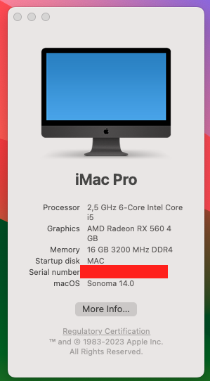

# Hackintosh - Opencore EFI for Huananzhi B660M-ITX

Support for macOS Sonoma (14.0).

## Changelog

## Hardware

| **Component**        | **Model**                                                                                   |
| -------------------- | ------------------------------------------------------------------------------------------- |
| CPU                  | Intel Core i5 12400F                                                                        |
| Motherboard          | [Huananzhi B660M-ITX](http://www.huananzhi.com/en/more.php?lm=10&id=640)                    |
| RAM                  | 16GB (1 x 16GB) Corsair Vengeance LPX @3200                                                 |
| GPU                  | [GIGABYTE RX 560 - 4GB](https://www.gigabyte.com/vn/Graphics-Card/GV-RX560OC-4GD-rev-10#kf) |
| OS Disk (Nvme/Sata3) | WD SN750                                                                                    |
| Display              | 1 x 1920x1080 (Dell P2319h) @ 60Hz                                                          |

# Compatible SMBIOS

| SMBIOS     | Description                                                   |
| :--------- | :------------------------------------------------------------ |
| iMacPro1,1 | Because GPU integrated in 12th gen without support for Apple. |

## Reference

- [Dortania's OpenCore Install Guide](https://dortania.github.io/OpenCore-Install-Guide/)
- [OpenCore Alder Lake (12th-Gen Intel) Hackintosh Guidance](https://github.com/luchina-gabriel/BASE-EFI-INTEL-DESKTOP-12THGEN-ALDER-LAKE)
